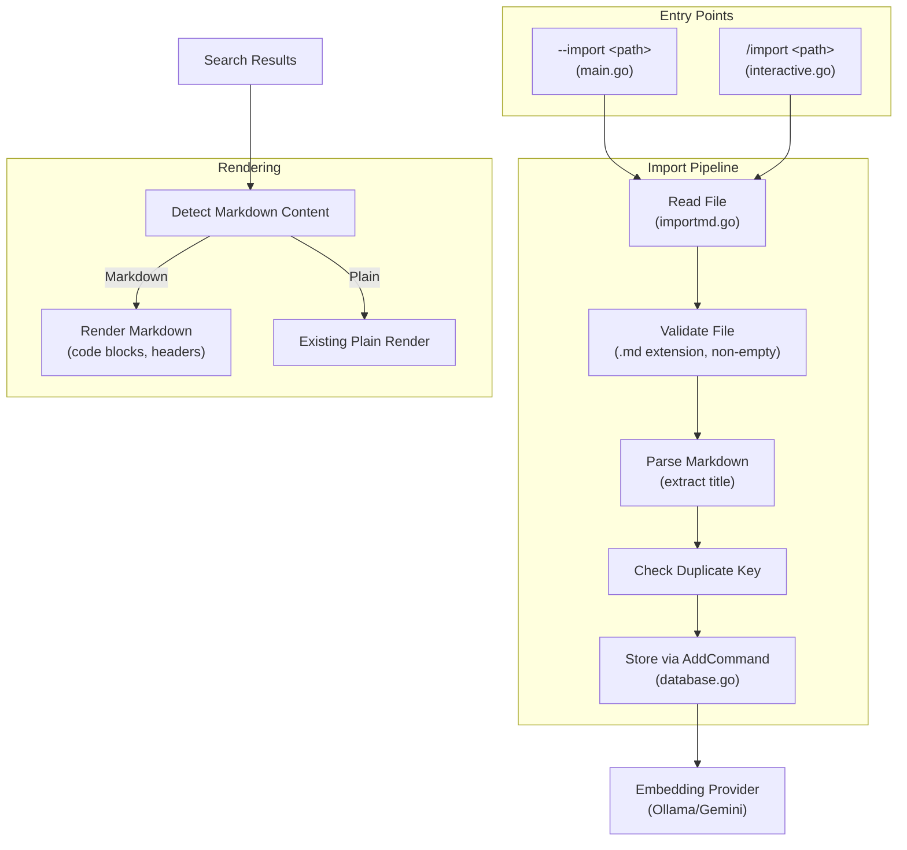

# Design Document: Markdown Import

## Overview

This feature adds markdown document import to scmd via two entry points: the `/import <path>` interactive command and the `--import <path>` CLI flag. Imported documents are stored in the existing `scmd` PostgreSQL table using the same `CommandRecord` schema (key/data/embedding). The document title becomes the key, the full markdown content becomes the data, and a vector embedding is generated for semantic search. The interactive CLI search results are enhanced with a markdown renderer that detects markdown content and formats code blocks and headers for terminal display.

The design reuses the existing `AddCommand` flow and embedding provider fallback chain (Ollama → Gemini) to keep changes minimal and consistent.

## Architecture



## Components and Interfaces

### 1. `importmd.go` — Markdown Import Module

New file containing all import logic.

```go
// ImportMarkdown reads a markdown file, validates it, extracts the title,
// checks for duplicates, and stores it via AddCommand.
// Returns an error if any step fails.
func ImportMarkdown(filePath string) (title string, err error)

// extractTitle parses the markdown content and returns the first
// top-level heading (# Title). Falls back to the filename without extension.
func extractTitle(content string, filePath string) string

// isMarkdownFile checks if the file path has a .md extension.
func isMarkdownFile(filePath string) bool
```

### 2. `rendermd.go` — Markdown Terminal Renderer

New file containing terminal rendering logic for markdown content.

```go
// RenderMarkdown formats markdown content for terminal display.
// Renders fenced code blocks with delimiters/labels and headers with ANSI styling.
func RenderMarkdown(content string) string

// isMarkdownContent detects whether a string contains markdown formatting
// (fenced code blocks, headers, etc.) vs plain command text.
func isMarkdownContent(content string) bool
```

### 3. Changes to Existing Files

**`interactive.go`**:
- Add `/import` case to `handleSlashCommand` switch
- Call `handleImportCommand(args)` which delegates to `ImportMarkdown`
- Update `performInteractiveSearch` to use `RenderMarkdown` for markdown content

**`main.go`**:
- Add `--import` flag handling in the `count == 3` branch
- Initialize DB and embedding providers, call `ImportMarkdown`, print result

**`helpmenu.go`**:
- Add `--import` usage line to help output

**`interactive.go` (help)**:
- Add `/import` to `printInteractiveHelp`

## Data Models

No new database tables or schema changes. Imported documents use the existing `CommandRecord` structure:

```go
type CommandRecord struct {
    Id   int    `json:"id"`
    Key  string `json:"key"`   // Document title (from # heading or filename)
    Data string `json:"data"`  // Full markdown content
}
```

The `embedding` column (pgvector) is populated via the existing `AddCommand` function which handles the Ollama → Gemini fallback chain.

### Content Detection Heuristic

To distinguish markdown documents from plain commands in search results, `isMarkdownContent` checks for:
- Fenced code blocks (`` ``` ``)
- Markdown headers (`# `, `## `, `### `)
- Markdown links (`[text](url)`)

If any of these patterns are present, the content is rendered through the markdown renderer.


## Correctness Properties

*A property is a characteristic or behavior that should hold true across all valid executions of a system — essentially, a formal statement about what the system should do. Properties serve as the bridge between human-readable specifications and machine-verifiable correctness guarantees.*

### Property 1: Non-markdown extensions are rejected

*For any* file path that does not end with `.md` (case-insensitive), `isMarkdownFile` should return false, causing the import to be rejected.

**Validates: Requirements 1.3**

### Property 2: Title extraction from heading

*For any* markdown string that contains at least one line starting with `# ` (a top-level heading), `extractTitle` should return the text of the first such heading (trimmed of the `# ` prefix and whitespace).

**Validates: Requirements 1.4**

### Property 3: Title fallback to filename

*For any* markdown string that contains no line starting with `# `, and any file path ending in `.md`, `extractTitle` should return the filename without the `.md` extension.

**Validates: Requirements 1.5**

### Property 4: Markdown detection accuracy

*For any* string containing fenced code blocks (`` ``` ``), markdown headers (`# `), or markdown links (`[text](url)`), `isMarkdownContent` should return true. *For any* string composed only of plain text without these markers, `isMarkdownContent` should return false.

**Validates: Requirements 4.3, 4.4**

### Property 5: Code block rendering preserves delimiters

*For any* markdown string containing fenced code blocks, `RenderMarkdown` should produce output that contains visible delimiter lines around each code block's content.

**Validates: Requirements 4.1**

### Property 6: Header rendering applies ANSI styling

*For any* markdown string containing headers (`#`, `##`, `###`), `RenderMarkdown` should produce output containing ANSI escape codes on the header lines.

**Validates: Requirements 4.2**

### Property 7: Content preservation round-trip

*For any* valid markdown string, storing it as the data field and retrieving it should yield an identical string. Specifically, the content passed to `AddCommand` as the description should be the exact original file content.

**Validates: Requirements 5.3**

## Error Handling

| Scenario | Behavior | Requirements |
|---|---|---|
| File not found | Return error with "file not found" message | 1.2, 2.2 |
| Non-.md extension | Return error with "only markdown files supported" message | 1.3, 2.3 |
| Empty file | Return error with "file is empty" message | 5.2 |
| Duplicate key | Return error with "document already exists" message | 1.6 |
| File read permission error | Return error with OS-provided message | 1.2, 2.2 |
| No embedding provider | Log warning, store without embedding (handled by existing `AddCommand`) | 3.4 |
| Database connection failure | Return error from `InitDB` (existing behavior) | — |

For the `--import` CLI flag, errors are printed to stderr and the process exits with code 1. For the `/import` interactive command, errors are printed to the interactive console and the user returns to the prompt.

## Testing Strategy

### Property-Based Testing

Use the `gopter` library (Go property testing) for property-based tests. Each property test runs a minimum of 100 iterations.

Property tests target the pure functions in `importmd.go` and `rendermd.go`:
- `isMarkdownFile` — Property 1
- `extractTitle` — Properties 2, 3
- `isMarkdownContent` — Property 4
- `RenderMarkdown` — Properties 5, 6

Each test is tagged with: **Feature: markdown-import, Property {N}: {title}**

### Unit Testing

Unit tests complement property tests for specific examples and edge cases:
- Import of the example `.local/diagram.md` file (integration example)
- Empty file rejection
- Duplicate key detection (requires DB mock or test DB)
- CLI flag routing (`--import` with valid/invalid paths)
- Interactive command routing (`/import` with valid/invalid paths)

### Test File Structure

- `importmd_test.go` — Property tests for file validation and title extraction, unit tests for import edge cases
- `rendermd_test.go` — Property tests for markdown detection and rendering
