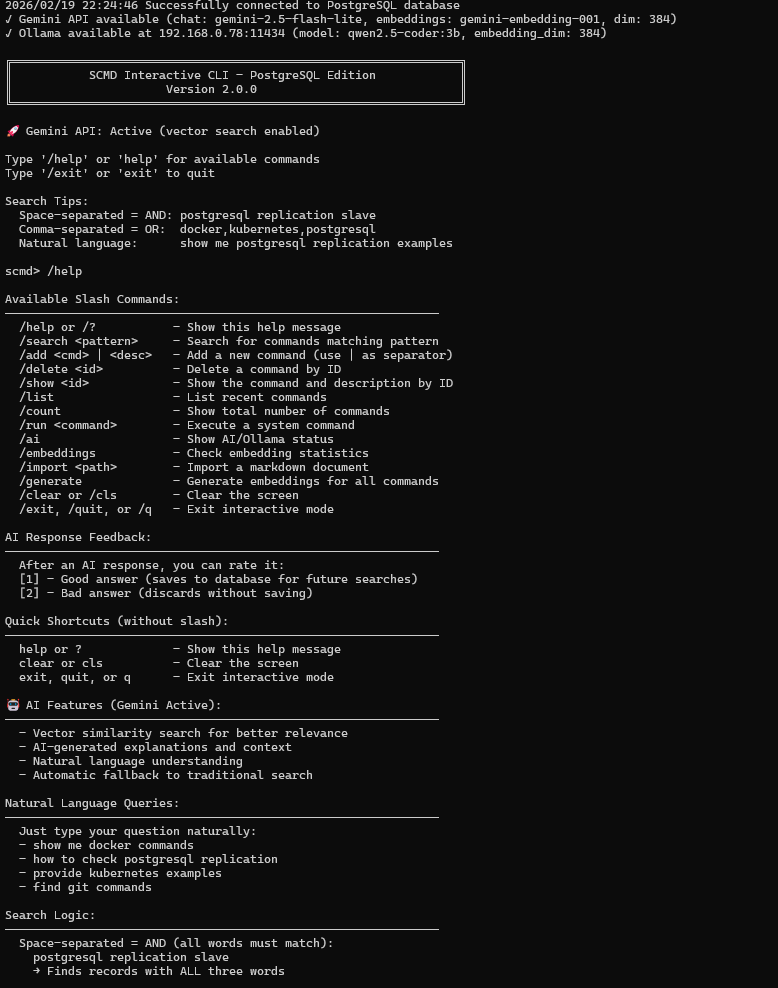
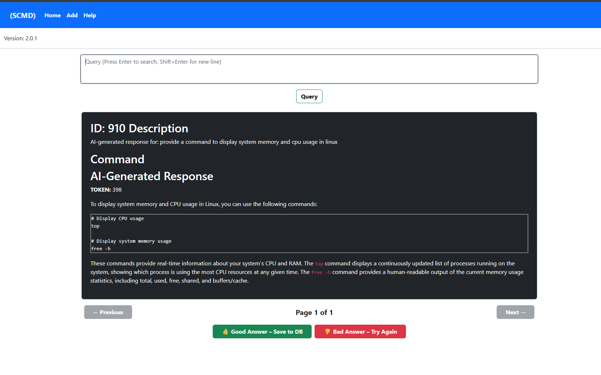

# scmd (Search Command)

Simple search command App that gives the possibility to find commands or store commands in a PostgreSQL database. This app features both CLI and Web UI interfaces.<BR>

## Database Migration Notice
**Version 2.0.0+** now uses PostgreSQL instead of SQLite (tardigrade.db). See [POSTGRESQL_MIGRATION.md](POSTGRESQL_MIGRATION.md) for migration details.

## Configuration

Create a `.env` file in the project root with your PostgreSQL connection details:

[.env Example](.env.example ".env Example")

## Usage Modes

### 1. Interactive CLI Mode (NEW!)

Start an interactive session with natural language support:

```bash
scmd-windows-amd64.exe --cli
```

**Features:**
- Natural language queries: "provide me with postgresql replication example"
- Direct keyword search: "postgresql replication"
- Slash commands: `/search`, `/add`, `/list`, `/count`, `/show`
- User-friendly prompts and formatted output

### Example of the extended functions menu

---


See [INTERACTIVE_MODE.md](INTERACTIVE_MODE.md) for detailed documentation.

### 2. Traditional CLI

**Search for commands:**
```bash
scmd-windows-amd64.exe --search "postgresql replication"
scmd-windows-amd64.exe --search "docker,kubernetes"
```

**Add new commands:**
```bash
scmd-windows-amd64.exe --save "docker ps -a" "List all containers"
```

### 3. Web Interface

**Start web server:**
```bash
scmd-windows-amd64.exe --web                    # Default port 3333
scmd-windows-amd64.exe --web -port 8080         # Custom port
scmd-windows-amd64.exe --web -block             # Read-only mode
scmd-windows-amd64.exe --web -service           # Background mode (no browser)
```

## Installation

### Download Pre-built Binaries

Download the latest release for your platform from the [GitHub Releases](https://github.com/gcclinux/scmd/releases) page:

- **Windows (AMD64):** `scmd-windows-amd64.exe`
- **Linux (AMD64):** `scmd-linux-amd64`
- **Linux (ARM64):** `scmd-linux-aarch64`
- **macOS (Intel):** `scmd-darwin-amd64`
- **macOS (Apple Silicon):** `scmd-darwin-arm64`

All binaries are ready to use - no compilation required!

### Build from Source

> Display this help menu
```
Usage: 	 scmd-Linux-x86_64(exe) --help
```
> Opens the web UI with default Port: "3333" 
```
Usage: 	 scmd-Linux-x86_64(exe) --web
```
> Opens the Web UI with default Port: "3333" & "DISABLE" add commands
```
Usage:   scmd-win-x86_64(exe) --web -block
```
> Opens the Web UI with alternative Port:
```
Usage: 	 scmd-Linux-x86_64(exe) --web -port [port]
```
> Opens the Web UI with alternative Port: & "DISABLE" add commands
```
Usage:   scmd-win-x86_64(exe) --web -port [port] -block
```
> Opens the web UI with alternative Port: (-service won't launch the browser)
```
Usage: 	 scmd-Linux-x86_64(exe) --web -port [port] -service
```
> Starts SCMD without launching Web UI & "DISABLE" add commands
```
Usage:   scmd-win-x86_64(exe) --web -port [port] -service -block
```
> Opens SSL Web UI with default Port: "3333" 
```
Usage: 	 scmd-Linux-x86_64(exe) --ssl [certificate.pem] [privkey.pem]
```
> Opens SSL Web UI with default Port: "3333" & "DISABLE" add commands
```
Usage:   scmd-win-x86_64(exe) --ssl [certificate.pem] [privkey.pem] -block
```
> Opens SSL web UI with alternative Port:
```
Usage: 	 scmd-Linux-x86_64(exe) --ssl -port [port] [certificate.pem] [privkey.pem]
```
> Opens SSL web UI with alternative Port: & "DISABLE" add commands
```
Usage:   scmd-win-x86_64(exe) --ssl -port [port] [certificate.pem] [privkey.pem] -block
```
> Starts SCMD SSL without launching Web UI
```
Usage: 	 scmd-Linux-x86_64(exe) --ssl -port [port] -service [certificate.pem] [privkey.pem]
```
> Starts SCMD SSL without launching Web UI & "DISABLE" add commands
```
Usage:   scmd-win-x86_64(exe) --ssl -port [port] -service [certificate.pem] [privkey.pem] -block
```
> Show local and available scmd version
```
Usage: 	 scmd-Linux-x86_64(exe) --version
```
> Create a copy for the commands database and save it in Home folder
```
Usage: 	 scmd-Linux-x86_64(exe) --copydb
```
> Download all available commands database from online (override locally saved commands)
```
Usage: 	 scmd-Linux-x86_64(exe) --download
```
> Download and upgrade the latest version of the scmd application binary
```
Usage: 	 scmd-Linux-x86_64(exe) --upgrade
```
> Search command based on comma separated pattern(s)
```
Usage: 	 scmd-Linux-x86_64(exe) --search "patterns"
```
> Save new command with description in the local database
```
Usage: 	 scmd-Linux-x86_64(exe) --save "command" "description"
```

### Build from Source

Build and compile scmd from source code will require:
- Go 1.23 or higher
- Git
- PostgreSQL database

Dependencies:
```bash
go get github.com/lib/pq
go get github.com/joho/godotenv
```

Build steps:
Build steps:

```bash
git clone https://github.com/gcclinux/scmd.git
cd scmd/
cp .env.example .env
# Edit .env with your PostgreSQL credentials
go mod tidy
go build -o scmd-$(uname)-$(uname -m) .
scmd-$(uname)-$(uname -m) --help
```

Or use the build script:

**Windows:**
```powershell
.\build.ps1 all          # Build for all platforms
.\build.ps1 windows      # Build for Windows only
.\build.ps1 linux        # Build for Linux only
.\build.ps1 darwin       # Build for macOS only
```

**Linux/macOS:**
```bash
./compile.sh             # Build for current platform
```

## Release History

See [CHANGELOG.md](CHANGELOG.md) for detailed release history.
