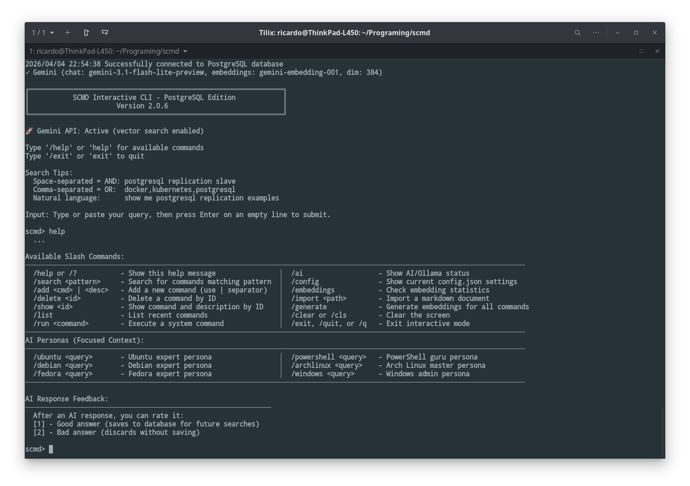
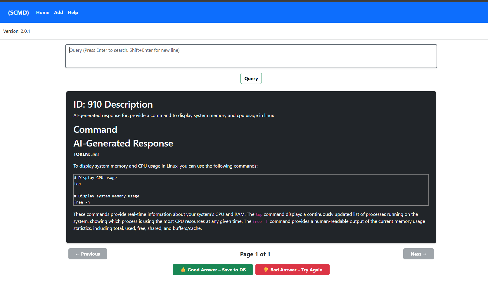
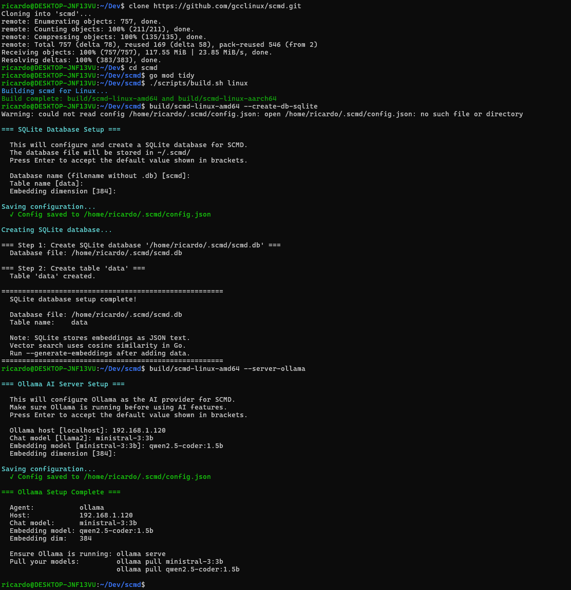
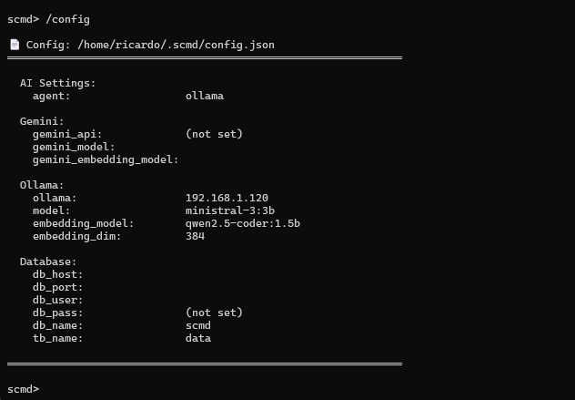
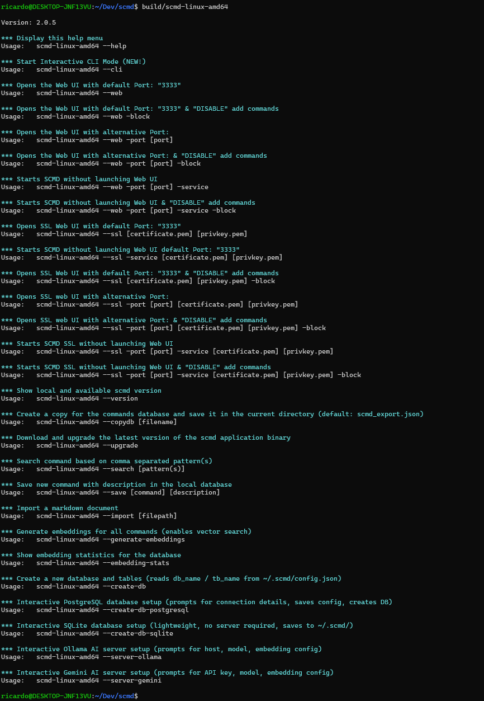
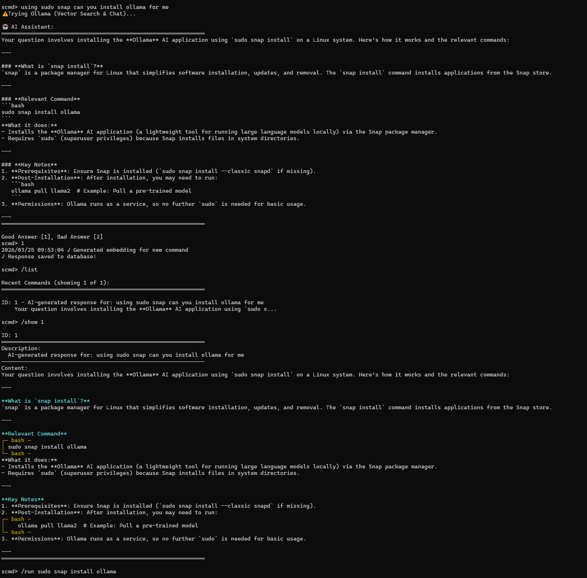

# SCMD — Search Command

> An AI-powered command search and management tool with CLI, Interactive, and Web interfaces.

**Version:** 2.0.6 | **Language:** Go 1.23 | **License:** MIT
**Author:** Ricardo Wagemaker | **Repo:** [github.com/gcclinux/scmd](https://github.com/gcclinux/scmd)

---

## What Is SCMD?

SCMD is a personal and team command knowledge base. Store, search, and retrieve CLI commands, code snippets, and documentation using keyword search, vector similarity, or natural language — from a terminal, interactive shell, or browser.

For a full feature breakdown and infographic-ready reference, see [docs/SCMD_INFOGRAPHIC.md](docs/SCMD_INFOGRAPHIC.md).

---

## Screenshots

### Interactive CLI — Slash Commands & AI Responses


### Web UI — Browser-Based Search Interface


### Easy Setup — Interactive Configuration Wizard


### Minimal Configuration — config.json


### Available Commands — Full CLI Reference


### Embedding-Powered Semantic Search


---

## Usage Modes

### 1. Interactive CLI (`--cli`)

Start an interactive session with natural language and slash command support:

```bash
scmd --cli
```

- Natural language queries: `"show me postgresql replication examples"`
- 14 slash commands: `/search`, `/add`, `/list`, `/delete`, `/show`, `/help`, `/import`, `/run`, `/ai`, `/config`, `/embeddings`, `/generate`, `/clear`, `/exit`
- 6 specialized persona commands: `/ubuntu`, `/debian`, `/fedora`, `/windows`, `/powershell`, `/archlinux`
- AI-powered explanations with context-aware responses
- Feedback loop — save or retry AI answers
- Markdown rendering in terminal

See [INTERACTIVE_MODE.md](docs/INTERACTIVE_MODE.md) and [SLASH_COMMANDS.md](docs/SLASH_COMMANDS.md) for detailed documentation.

### 2. Traditional CLI

```bash
scmd --search "postgresql replication"       # AND logic (all words must match)
scmd --search "docker,kubernetes"            # OR logic (any pattern matches)
scmd --save "docker ps -a" "List all containers"
scmd --import ./runbook.md                   # Import markdown documents
scmd --copydb                                # Export database to JSON
```

JSON output, scriptable, automation-friendly.

### 3. Web Interface (`--web` / `--ssl`)

```bash
scmd --web                                   # Default port 3333
scmd --web -port 8080                        # Custom port
scmd --web -block                            # Read-only mode
scmd --web -port 8080 -service               # Headless / background mode
scmd --ssl cert.pem key.pem                  # HTTPS with custom certificates
```

- Browser-based search with real-time results
- Add commands via form with duplicate detection
- AI-generated explanations inline
- Syntax highlighting for code blocks
- Session-based authentication (email + API key, 24h sessions)
- SSL/TLS support for secure access

### 4. MCP Server (`--mcp`)

```bash
scmd --mcp
```

The **Model Context Protocol (MCP)** interface allows local AI assistants (like Claude Desktop, Cursor, or VS Code extensions) to directly interact with your `scmd` database.

- **Human -> Database**: Use `--cli` or `--web` for manual search.
- **AI Agent -> Database**: Use `--mcp` to let your AI assistant search your "brain" for you.

**Exposed Tools:**
- `search_commands`: AI-powered semantic search across your commands.
- `add_command`: Let the AI save useful commands it generates for you.
- `get_stats`: Monitor your database and embedding health.

See [MCP-walkthrough.md](docs/MCP-walkthrough.md) for setup and registration details.

---

## AI Integration

### Dual Provider Architecture

| Provider | Type | Use Case |
|----------|------|----------|
| Ollama | Local / Remote | Privacy-first, self-hosted, no API costs |
| Google Gemini | Cloud API | High quality, free tier (1,500 req/day) |

- Configurable preferred provider via `agent` field in config
- Automatic fallback: Ollama → Gemini (or vice versa)
- Separate models for chat and embeddings
- Setup wizards: `--server-ollama` / `--server-gemini`

### Smart Search Pipeline

```
User Query
  → Keyword Extraction (NLP stop-word removal)
    → PostgreSQL ILIKE Search
      → Score & Rank Results (word-match %)
        → Score ≥ 60%? → Return ranked results
        → Score < 60%? → Vector Similarity Search (pgvector / cosine)
          → Still low? → Pure AI Chat Response
```

### Embeddings

- Generate vector embeddings for all stored commands (`--generate-embeddings`)
- Configurable dimensions (384, 768, etc.)
- Batch generation with progress tracking
- Stats dashboard (`--embedding-stats`)
- Supports pgvector (PostgreSQL) and in-memory cosine similarity (SQLite)

See [EMBEDDING_DIMENSIONS.md](docs/EMBEDDING_DIMENSIONS.md) and [SEARCH_GUIDE.md](docs/SEARCH_GUIDE.md) for details.

---

## Database Support

| Feature | PostgreSQL | SQLite |
|---------|-----------|--------|
| Type | Client-server | File-based |
| Vector Search | pgvector extension | Go cosine similarity |
| Multi-user | Yes | Single-user |
| Setup | `--create-db-postgresql` | `--create-db-sqlite` |
| Location | Remote/local server | `~/.scmd/scmd.db` |
| Scalability | Enterprise | Lightweight |

See [POSTGRESQL_MIGRATION.md](docs/POSTGRESQL_MIGRATION.md) for migration details from older SQLite versions.

---

## Configuration

Create `~/.scmd/config.json` (or copy the example):

```bash
mkdir -p ~/.scmd
cp config.json.example ~/.scmd/config.json
```

```json
{
  "agent": "ollama",
  "db_type": "postgresql",
  "db_host": "localhost",
  "db_port": "5432",
  "db_user": "your_username",
  "db_pass": "your_password",
  "db_name": "your_database",
  "tb_name": "scmd",
  "gemini_api": "your_gemini_api_key_here",
  "gemini_model": "gemini-2.5-flash-lite",
  "gemini_embedding_model": "gemini-embedding-001",
  "ollama": "localhost",
  "model": "ministral-3:3b",
  "embedding_model": "qwen2.5-coder:1.5b",
  "embedding_dim": "384"
}
```

Environment variables override config file values. See [config.json.example](config.json.example) for the full template.

---

## Installation

### Download Pre-built Binaries

Download the latest release for your platform from [GitHub Releases](https://github.com/gcclinux/scmd/releases):

| Platform | Binary |
|----------|--------|
| Windows (AMD64) | `scmd-win-x86_64.exe` |
| Linux (AMD64) | `scmd-Linux-x86_64` |
| Linux (ARM64) | `scmd-Linux-aarch64` |
| macOS (Intel) | `scmd-Darwin-amd64` |
| macOS (Apple Silicon) | `scmd-Darwin-arm64` |

All binaries are ready to use — no compilation required.

### Build from Source

Requires Go 1.23+, Git, and a PostgreSQL or SQLite database.

```bash
git clone https://github.com/gcclinux/scmd.git
cd scmd/
mkdir -p ~/.scmd
cp config.json.example ~/.scmd/config.json
# Edit ~/.scmd/config.json with your database and AI settings
go mod tidy
go build -o scmd ./cmd/scmd/
./scmd --help
```

Build scripts:

```powershell
# Windows
.\scripts\build.ps1 all          # All platforms
.\scripts\build.ps1 windows      # Windows only
```

```bash
# Linux / macOS
./scripts/compile.sh             # Current platform
```

### Docker

```bash
docker pull gcclinux/scmd:latest
docker run -p 8080:8080 gcclinux/scmd:latest --web -port 8080 -service
```

Or use Docker Compose:

```bash
cd docker/
docker-compose up -d
```

---

## CLI Reference

### Help & Version
| Command | Description |
|---------|-------------|
| `--help` | Display help menu |
| `--version` | Show local and available version |
| `--upgrade` | Download and upgrade binary |

### Search & Save
| Command | Description |
|---------|-------------|
| `--search "pattern"` | Search with AND/OR logic |
| `--save "cmd" "desc"` | Add new command |
| `--import <path>` | Import markdown file |
| `--copydb [filename]` | Export database to JSON |

### Database Setup
| Command | Description |
|---------|-------------|
| `--create-db` | Interactive database setup |
| `--create-db-postgresql` | PostgreSQL setup wizard |
| `--create-db-sqlite` | SQLite setup wizard |

### AI & Embeddings
| Command | Description |
|---------|-------------|
| `--server-ollama` | Setup Ollama AI provider |
| `--server-gemini` | Setup Gemini AI provider |
| `--generate-embeddings` | Generate embeddings for all commands |
| `--embedding-stats` | Show embedding statistics |

### Web Server
| Command | Description |
|---------|-------------|
| `--web` | Start web UI (default port 3333) |
| `--web -port [port]` | Custom port |
| `--web -block` | Read-only mode |
| `--web -service` | Background / headless mode |
| `--ssl [cert] [key]` | HTTPS mode |
| `--mcp` | Start MCP server (stdio) |

---

## Search Capabilities

- **AND logic** (spaces): `postgresql replication slave` — all words must match
- **OR logic** (commas): `docker,kubernetes` — any pattern matches
- **Combined**: `postgresql replication,docker backup`
- Case-insensitive, partial word matching
- Intelligent scoring with 60% threshold before AI fallback
- NLP keyword extraction (removes stop words like "show me", "how to", "please")

See [SCORING_SYSTEM.md](docs/SCORING_SYSTEM.md) and [SEARCH_IMPROVEMENT.md](docs/SEARCH_IMPROVEMENT.md) for details.

---

## Security

- Session-based web authentication (email + API key)
- 24-hour session expiry with automatic cleanup
- HTTP-only cookies with SameSite protection
- Read-only mode (`-block`) to prevent unauthorized additions
- SSL/TLS with custom certificate support

See [AUTHENTICATION.md](docs/AUTHENTICATION.md) for setup instructions.

---

## Architecture

```
┌─────────────────────────────────────────────────┐
│                    SCMD v2.0.6                  │
├─────────────┬──────────────┬──────────────┬────────────────────┤
│ Interactive  │ Traditional  │  MCP Server  │     Web UI         │
│    CLI       │    CLI       │   (stdio)    │  (HTTP/HTTPS)      │
├─────────────┴──────────────┴──────────────┴────────────────────┤
│              Core Engine                         │
│  ┌──────────┐ ┌──────────┐ ┌──────────────────┐ │
│  │ Search   │ │ Scoring  │ │ Keyword Extract  │ │
│  │ Engine   │ │ System   │ │ (NLP)            │ │
│  └──────────┘ └──────────┘ └──────────────────┘ │
├──────────────────────────────────────────────────┤
│              AI Layer                            │
│  ┌──────────────────┐ ┌───────────────────────┐ │
│  │ Ollama (Local)   │ │ Gemini (Cloud)        │ │
│  │ Chat + Embedding │ │ Chat + Embedding      │ │
│  └──────────────────┘ └───────────────────────┘ │
├──────────────────────────────────────────────────┤
│              Data Layer                          │
│  ┌──────────────────┐ ┌───────────────────────┐ │
│  │ PostgreSQL       │ │ SQLite                │ │
│  │ + pgvector       │ │ + cosine similarity   │ │
│  └──────────────────┘ └───────────────────────┘ │
└──────────────────────────────────────────────────┘
```

---

## Documentation

| Document | Description |
|----------|-------------|
| [FEATURES.md](docs/FEATURES.md) | Feature comparison matrix |
| [INTERACTIVE_MODE.md](docs/INTERACTIVE_MODE.md) | Interactive CLI guide |
| [SLASH_COMMANDS.md](docs/SLASH_COMMANDS.md) | Slash command reference |
| [SEARCH_GUIDE.md](docs/SEARCH_GUIDE.md) | Search patterns and tips |
| [SCORING_SYSTEM.md](docs/SCORING_SYSTEM.md) | Intelligent ranking system |
| [GEMINI_INTEGRATION.md](docs/GEMINI_INTEGRATION.md) | Google Gemini setup |
| [OLLAMA_INTEGRATION.md](docs/OLLAMA_INTEGRATION.md) | Ollama setup |
| [AUTHENTICATION.md](docs/AUTHENTICATION.md) | Web authentication system |
| [POSTGRESQL_MIGRATION.md](docs/POSTGRESQL_MIGRATION.md) | Database migration guide |
| [QUICKSTART.md](docs/QUICKSTART.md) | Getting started |
| [WHATS_NEW.md](docs/WHATS_NEW.md) | What's new in v2.0 |
| [SCMD_INFOGRAPHIC.md](docs/SCMD_INFOGRAPHIC.md) | Full capabilities overview |

---

## Release History

See [CHANGELOG.md](CHANGELOG.md) for detailed release history.

---

## License

[MIT](LICENSE)
