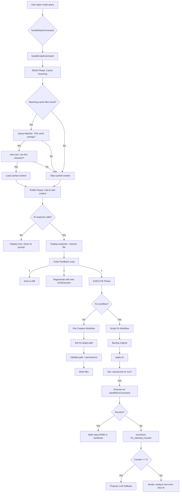
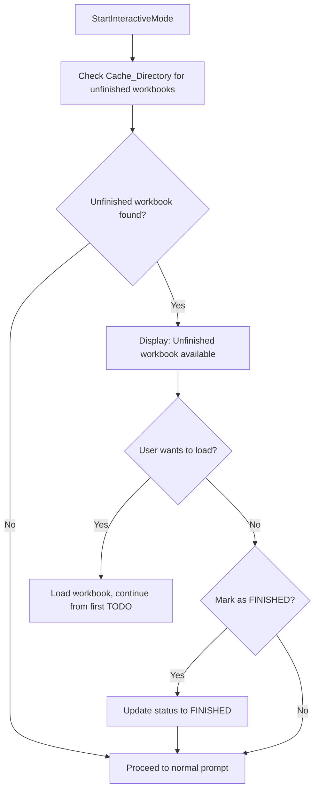

# Design Document: Code Agent (Agentic RAG Developer)

## Overview

The `/code <query>` command adds an **Agentic RAG (Retrieval-Augmented Generation) developer** to the SCMD interactive CLI. Unlike the OS-specific personas (`/ubuntu`, `/debian`, etc.) that produce ephemeral AI responses, and unlike the `/research` persona that only recommends, the `/code` agent is an autonomous developer agent that:

1. **READs** existing cache and research files (RAG) to find relevant prior work.
2. **THINKs** through problems and generates proposed actions, code, or scripts.
3. **EXECUTEs** actions on the user's behalf — creating files, fixing scripts, and tracking multi-step plans in workbooks.

The agent is fully interactive, confirming each step with the user before proceeding. It supports a **Script Fix Workflow** (error parsing → backup → fix → test → iterate), a **Workbook System** for persistent multi-step plans, and **LLM Fallback** to switch AI providers after repeated failures.

Key differentiators from the `/research` persona:
- Produces executable code (not just recommendations)
- Creates/modifies files on the filesystem
- Has a fix-iterate loop with backup and rollback
- Tracks multi-step plans persistently via workbooks
- Offers `[x]` execute in the feedback loop (research only offers `[s]`/`[n]`)

## Architecture

The feature integrates into the existing SCMD architecture at four points:

1. **Persona Registry** (`internal/ai/aiPersona.go`): A new `"code"` entry in `GetPersonas()` with the Agentic RAG developer system prompt.
2. **Command Dispatcher** (`internal/cli/commands.go`): A new `/code` case in `handleSlashCommand()` that calls `handleCodeCommand()`.
3. **Interactive Loop** (`internal/cli/interactive.go`): Code-specific feedback path with `[s]`/`[n]`/`[x]` options, plus startup workbook detection.
4. **New Files**: `internal/cli/code.go` (main handler, cache scanning, session management) and `internal/cli/workbook.go` (workbook parsing, status management, file operations).



### Startup Workbook Detection Flow



## Components and Interfaces

### New File: `internal/cli/code.go`

Contains all `/code` agent-specific logic: cache scanning, query matching, session management, fix workflow, and LLM fallback.

#### Constants

```go
const codeTimestampLayout = "2006-01-02_15-04-05"
const codeSessionPrefix = "scmd-code-"
const backupPrefix = "backup-"
const queryMatchThreshold = 0.70 // 70% word-overlap ratio
const maxFixAttempts = 3
```

#### Functions

| Function | Signature | Description |
|---|---|---|
| `handleCodeCommand` | `func handleCodeCommand(args string) (response string, uid string, filePath string)` | Main entry point. Orchestrates READ→THINK→EXECUTE phases. Returns AI response, UUID, and session file path for the feedback loop. |
| `scanCacheFiles` | `func scanCacheFiles(query string) ([]string, error)` | Searches Cache_Directory for files matching query terms using OS-native commands (`grep`/`findstr`). Returns list of matching file paths. |
| `buildSearchCommand` | `func buildSearchCommand(cacheDir string, queryTerms []string) *exec.Cmd` | Constructs the appropriate `exec.Cmd` based on `runtime.GOOS` — `findstr` on Windows, `grep` on Linux/macOS. |
| `computeWordOverlap` | `func computeWordOverlap(query string, content string) float64` | Computes the word-overlap ratio: (count of query words found in content) / (total query words). Returns a float64 in [0.0, 1.0]. |
| `isRelevantMatch` | `func isRelevantMatch(query string, content string) bool` | Returns true if `computeWordOverlap(query, content) >= queryMatchThreshold`. |
| `buildCodeSessionFilename` | `func buildCodeSessionFilename(t time.Time) string` | Returns `scmd-code-YYYY-MM-DD_HH-mm-SS.md` for the given time. |
| `assembleCodeSessionContent` | `func assembleCodeSessionContent(uid, query, response string) string` | Assembles session file: ID header, blank, `# query`, blank, response body. |
| `buildCodeFeedbackPrompt` | `func buildCodeFeedbackPrompt(codeBlockCount int) string` | Returns feedback prompt with `[s]`, `[n]`, `[x]` and numbered block selectors when multiple blocks exist. |
| `isCodeFeedbackInput` | `func isCodeFeedbackInput(input string, codeBlockCount int) bool` | Returns true for "s", "n", "x"-prefixed input, or bare numbers when code blocks exist. |
| `buildBackupFilename` | `func buildBackupFilename(originalName string, t time.Time) string` | Returns `backup-<originalName>-YYYY-MM-DD_HH-mm-SS`. |
| `createScriptBackup` | `func createScriptBackup(scriptPath string) (backupPath string, err error)` | Copies the original script to Cache_Directory with backup filename. Returns the backup path. |
| `validateTargetPath` | `func validateTargetPath(path string) (valid bool, reason string)` | Checks path exists, is a directory, and is writable. Returns validity and reason string. |
| `handleFixWorkflow` | `func handleFixWorkflow(scriptPath string, errorDesc string, reader *bufio.Reader) string` | Orchestrates the fix loop: backup → AI fix → user test → iterate. Returns final session content. |
| `detectCurrentProvider` | `func detectCurrentProvider() string` | Returns "ollama" or "gemini" based on which provider handled the last request. |
| `getAlternativeProvider` | `func getAlternativeProvider(current string) string` | Returns the opposite provider name. |
| `proposeLLMFallback` | `func proposeLLMFallback(current string, errorHistory []string) (string, error)` | Calls the alternative provider with full error history. Returns the new AI response. |

### New File: `internal/cli/workbook.go`

Contains workbook parsing, serialization, status management, and file operations.

#### Types

```go
// WorkbookStatus represents the overall state of a workbook.
type WorkbookStatus string

const (
    WorkbookStarted  WorkbookStatus = "STARTED"
    WorkbookProgress WorkbookStatus = "PROGRESS"
    WorkbookFinished WorkbookStatus = "FINISHED"
)

// StepStatus represents the state of an individual workbook step.
type StepStatus string

const (
    StepTodo StepStatus = "TODO"
    StepDone StepStatus = "DONE"
)

// WorkbookStep represents a single action item in a workbook.
type WorkbookStep struct {
    Number      int
    Description string
    Status      StepStatus
}

// Workbook represents a parsed workbook file.
type Workbook struct {
    Title    string
    Status   WorkbookStatus
    Steps    []WorkbookStep
    FilePath string
}
```

#### Functions

| Function | Signature | Description |
|---|---|---|
| `buildWorkbookFilename` | `func buildWorkbookFilename(t time.Time) string` | Returns `scmd-workbook-YYYY-MM-DD_HH-mm-SS.md` for the given time. |
| `parseWorkbook` | `func parseWorkbook(content string) (*Workbook, error)` | Parses a workbook markdown file into a `Workbook` struct. |
| `serializeWorkbook` | `func serializeWorkbook(wb *Workbook) string` | Serializes a `Workbook` struct back to markdown format. |
| `createWorkbook` | `func createWorkbook(title string, steps []string) (*Workbook, error)` | Creates a new workbook file with STARTED status and all steps as TODO. |
| `updateWorkbookStep` | `func updateWorkbookStep(wb *Workbook, stepNumber int) error` | Marks a step as DONE and updates overall status. Writes changes to file. |
| `computeWorkbookStatus` | `func computeWorkbookStatus(steps []WorkbookStep) WorkbookStatus` | Computes the correct overall status based on step states. |
| `findUnfinishedWorkbooks` | `func findUnfinishedWorkbooks() ([]string, error)` | Scans Cache_Directory for workbook files with STARTED or PROGRESS status. Returns paths sorted by timestamp (most recent first). |
| `selectMostRecentWorkbook` | `func selectMostRecentWorkbook(paths []string) string` | Returns the path with the most recent timestamp from a list of workbook file paths. |
| `findFirstTodoStep` | `func findFirstTodoStep(wb *Workbook) (int, error)` | Returns the index of the first step with TODO status, or error if none found. |
| `checkStartupWorkbook` | `func checkStartupWorkbook() (*Workbook, error)` | Called at startup to find and parse the most recent unfinished workbook. Returns nil if none found. |

### Workbook Markdown Format

```markdown
# Workbook: <title>

**Status:** STARTED | PROGRESS | FINISHED
**Created:** YYYY-MM-DD HH:mm:SS

## Steps

- [TODO] 1. First step description
- [TODO] 2. Second step description
- [DONE] 3. Third step description
```

### Modified File: `internal/ai/aiPersona.go`

Add a `"code"` entry to the `GetPersonas()` map:

```go
"code": {
    Name:        "Agentic RAG Developer",
    Description: "Read, Think, execute Agentic RAG",
    SystemPrompt: `You are an Agentic RAG Developer AI. Your role is to read existing context, think through problems, and propose executable code, scripts, and file operations.

RULES:
1. Always format your response as structured markdown with clear headings.
2. Present all code and scripts in markdown code blocks with appropriate language tags.
3. Every response MUST include at minimum these sections:
   ## Analysis
   ## Proposed Code
   ## Summary
4. When fixing scripts, include a "## Diagnosis" section explaining the root cause.
5. When creating new files, include a "## File Structure" section listing all files to be created.
6. Be specific about file paths, permissions, and dependencies.
7. End every response with a concise Summary section including next steps.`,
},
```

### Modified File: `internal/cli/commands.go`

Add a `/code` case to `handleSlashCommand()`:

```go
case "/code":
    if args == "" {
        fmt.Println("Usage: /code <question or description>")
        return ""
    }
    resp, uid, fpath := handleCodeCommand(args)
    lastCodeUID = uid
    lastCodeFilePath = fpath
    lastCodeQuery = args
    return resp
```

### Modified File: `internal/cli/interactive.go`

1. Add startup workbook detection at the beginning of `StartInteractiveMode()` (after `ai.InitProviders()`).
2. Add a `lastFromCode bool` flag and code-specific feedback path similar to the research feedback path.
3. The code feedback path handles `[s]`, `[n]`, `[x]`, and numbered block selectors.

## Data Models

### Code Session File Structure

```
<!-- SCMD-ID: xxxxxxxx-xxxx-4xxx-yxxx-xxxxxxxxxxxx -->

# <original query>

<AI-generated response with proposed code>

## Session Log

- Decision: <user's approval/decline>
- Target Path: <path if file creation>
- Files Created: <list of created files>
- Fix Attempts: <count if fix workflow>
```

### Cache Directory Layout

```
~/.scmd/cache/
├── scmd-2026-04-30_09-15-29.md          # Research files (existing)
├── scmd-code-2026-05-01_14-30-00.md     # Code session files (new)
├── scmd-workbook-2026-05-01_14-30-00.md # Workbook files (new)
└── backup-myscript.sh-2026-05-01_14-30-00  # Script backups (new)
```

### Filename Prefixes (Distinguishing File Types)

| File Type | Prefix | Example |
|---|---|---|
| Research | `scmd-` | `scmd-2026-04-30_09-15-29.md` |
| Code Session | `scmd-code-` | `scmd-code-2026-05-01_14-30-00.md` |
| Workbook | `scmd-workbook-` | `scmd-workbook-2026-05-01_14-30-00.md` |
| Script Backup | `backup-` | `backup-deploy.sh-2026-05-01_14-30-00` |

### Timestamp Format

All timestamps use Go's reference time layout:

```go
const codeTimestampLayout = "2006-01-02_15-04-05"
```

### UUID Format

Standard UUID v4: `xxxxxxxx-xxxx-4xxx-yxxx-xxxxxxxxxxxx`
Wrapped in HTML comment for file header: `<!-- SCMD-ID: <uuid> -->`

### Word-Overlap Ratio Computation

```
overlap_ratio = count(query_words ∩ content_words) / count(query_words)
```

Where:
- Words are lowercased and split on whitespace
- A query word is "found" if it appears anywhere in the content (case-insensitive)
- Threshold: `overlap_ratio >= 0.70` → file is relevant

### Fix Attempt Counter

- Per-session counter starting at 0
- Increments on each unsuccessful fix attempt
- Triggers LLM fallback proposal at `maxFixAttempts = 3`
- Resets to 0 on new `/code fix` invocation

## Correctness Properties

*A property is a characteristic or behavior that should hold true across all valid executions of a system — essentially, a formal statement about what the system should do. Properties serve as the bridge between human-readable specifications and machine-verifiable correctness guarantees.*

### Property 1: Query matcher threshold correctness

*For any* query string and any file content string, `isRelevantMatch(query, content)` SHALL return `true` if and only if the word-overlap ratio (count of query words found in content divided by total query words) is greater than or equal to 0.70.

**Validates: Requirements 3.1, 3.2**

### Property 2: Code session filename format

*For any* valid `time.Time` value, `buildCodeSessionFilename(t)` SHALL produce a string matching the pattern `scmd-code-\d{4}-\d{2}-\d{2}_\d{2}-\d{2}-\d{2}\.md` with zero-padded 24-hour time components.

**Validates: Requirements 6.2, 9.1**

### Property 3: Code session filename round-trip

*For any* valid `time.Time` value, formatting it with `buildCodeSessionFilename` and then parsing the timestamp portion back using the same layout SHALL produce a time equal to the original time truncated to the second.

**Validates: Requirements 9.2**

### Property 4: Code session file content structure

*For any* triple of (UUID string, query string, response string), `assembleCodeSessionContent(uid, query, response)` SHALL produce content where: the first line is `<!-- SCMD-ID: <uuid> -->`, the second line is blank, the third line is `# <query>`, the fourth line is blank, and the remainder is the response string.

**Validates: Requirements 6.3, 6.4, 6.5**

### Property 5: UUID uniqueness

*For any* batch of N generated UUIDs (where N is drawn randomly up to 1000), all UUIDs in the batch SHALL be distinct.

**Validates: Requirements 6.1**

### Property 6: Code feedback prompt correctness

*For any* non-negative integer `codeBlockCount`, `buildCodeFeedbackPrompt(codeBlockCount)` SHALL contain `[s]`, `[n]`, and `[x]`. When `codeBlockCount > 1`, the prompt SHALL additionally contain numbered block selectors `[1]` through `[codeBlockCount]`.

**Validates: Requirements 7.1, 7.6**

### Property 7: Non-feedback input rejection

*For any* string that is not "s", not "n", does not start with "x", and is not a valid integer (when code blocks exist), `isCodeFeedbackInput(input, codeBlockCount)` SHALL return `false`.

**Validates: Requirements 7.5**

### Property 8: Script backup round-trip

*For any* valid file path pointing to a readable file, creating a Script_Backup via `createScriptBackup` and reading the backup file back SHALL produce content identical to the original file.

**Validates: Requirements 11.2, 11.9**

### Property 9: Backup filename format

*For any* valid original filename string (containing no path separators) and any valid `time.Time` value, `buildBackupFilename(originalName, t)` SHALL produce a string matching the pattern `backup-<originalName>-\d{4}-\d{2}-\d{2}_\d{2}-\d{2}-\d{2}`.

**Validates: Requirements 11.3**

### Property 10: Fix attempt counter behavior

*For any* sequence of fix outcomes (success or failure), the Fix_Attempt_Counter SHALL equal the number of consecutive failures since the last reset. The counter SHALL trigger LLM fallback proposal exactly when it reaches 3. The counter SHALL reset to 0 when a new fix session begins.

**Validates: Requirements 12.1, 12.2, 12.8**

### Property 11: Workbook filename format

*For any* valid `time.Time` value, `buildWorkbookFilename(t)` SHALL produce a string matching the pattern `scmd-workbook-\d{4}-\d{2}-\d{2}_\d{2}-\d{2}-\d{2}\.md` with zero-padded 24-hour time components.

**Validates: Requirements 13.2, 16.1**

### Property 12: Workbook filename round-trip

*For any* valid `time.Time` value, formatting it with `buildWorkbookFilename` and then parsing the timestamp portion back using the same layout SHALL produce a time equal to the original time truncated to the second.

**Validates: Requirements 16.2**

### Property 13: Workbook status invariant

*For any* workbook with a list of steps, `computeWorkbookStatus(steps)` SHALL return: `STARTED` when all steps are `TODO`, `PROGRESS` when at least one step is `DONE` and at least one is `TODO`, and `FINISHED` when all steps are `DONE`.

**Validates: Requirements 13.5, 13.6, 13.7**

### Property 14: Workbook parse/serialize round-trip

*For any* valid Workbook struct (with any combination of title, status, and steps), serializing with `serializeWorkbook` and then parsing with `parseWorkbook` SHALL produce a Workbook with identical title, status, and step definitions.

**Validates: Requirements 13.9**

### Property 15: Most recent workbook selection

*For any* non-empty set of workbook file paths with distinct timestamps, `selectMostRecentWorkbook(paths)` SHALL return the path whose embedded timestamp is the latest (most recent in time).

**Validates: Requirements 14.2**

### Property 16: First TODO step selection

*For any* workbook containing at least one step with `TODO` status, `findFirstTodoStep(wb)` SHALL return the index of the step with the smallest step number that has `TODO` status.

**Validates: Requirements 14.4**

## Error Handling

| Scenario | Behaviour |
|---|---|
| No query provided (`/code` alone) | Display usage message, return empty string |
| Cache_Directory does not exist | Skip READ phase, proceed to THINK phase without error |
| Cache_Directory is empty | Skip READ phase, proceed to THINK phase |
| OS-native search command fails | Log warning, skip READ phase, proceed to THINK phase |
| AI provider unavailable | Display error message, return to interactive prompt |
| AI provider returns empty response | Display "Failed to generate proposal", return to prompt |
| Target path does not exist | Inform user, ask for valid path |
| Target path is not a directory | Inform user, ask for valid path |
| Target path not writable | Inform user permission denied, ask for alternative path |
| Cache directory cannot be created | Display warning, continue without file storage |
| Session file cannot be written | Display warning, continue interaction |
| Script file not found for fix | Display error with path, return to prompt |
| Script file not readable | Display error with OS message, return to prompt |
| Backup creation fails | Display error, abort fix workflow (don't modify without backup) |
| Fix application fails (write error) | Display error, inform user original is preserved via backup |
| LLM fallback provider unavailable | Inform user no alternative configured, suggest manual review |
| Workbook file corrupted/unparseable | Display warning, skip workbook, proceed to normal prompt |
| Workbook write fails during step update | Display warning, continue interaction (step completed but not persisted) |

### Design Decision: Fail-Safe Fix Workflow

The fix workflow is designed to never lose user data:
1. A backup is **always** created before any modification.
2. If backup creation fails, the fix is aborted entirely.
3. The backup path is always displayed to the user.
4. The user is always asked before each fix attempt.

### Design Decision: Graceful Degradation

All file I/O failures (cache dir, session files, workbook writes) result in warnings but never abort the core interaction. The user always sees the AI response even if persistence fails.

## Testing Strategy

### Property-Based Tests (using `pgregory.net/rapid`)

The project already uses `pgregory.net/rapid` for property-based testing. Each property test runs a minimum of 100 iterations.

| Property | Test Function | File |
|---|---|---|
| Property 1: Query matcher threshold | `TestProperty_QueryMatcherThreshold` | `internal/cli/code_property_test.go` |
| Property 2: Code session filename format | `TestProperty_CodeSessionFilenameFormat` | `internal/cli/code_property_test.go` |
| Property 3: Code session filename round-trip | `TestProperty_CodeSessionFilenameRoundTrip` | `internal/cli/code_property_test.go` |
| Property 4: Session file content structure | `TestProperty_CodeSessionContentStructure` | `internal/cli/code_property_test.go` |
| Property 5: UUID uniqueness | `TestProperty_CodeUUIDUniqueness` | `internal/cli/code_property_test.go` |
| Property 6: Code feedback prompt correctness | `TestProperty_CodeFeedbackPrompt` | `internal/cli/code_property_test.go` |
| Property 7: Non-feedback input rejection | `TestProperty_CodeNonFeedbackRejection` | `internal/cli/code_property_test.go` |
| Property 8: Script backup round-trip | `TestProperty_ScriptBackupRoundTrip` | `internal/cli/code_property_test.go` |
| Property 9: Backup filename format | `TestProperty_BackupFilenameFormat` | `internal/cli/code_property_test.go` |
| Property 10: Fix attempt counter behavior | `TestProperty_FixAttemptCounter` | `internal/cli/code_property_test.go` |
| Property 11: Workbook filename format | `TestProperty_WorkbookFilenameFormat` | `internal/cli/workbook_property_test.go` |
| Property 12: Workbook filename round-trip | `TestProperty_WorkbookFilenameRoundTrip` | `internal/cli/workbook_property_test.go` |
| Property 13: Workbook status invariant | `TestProperty_WorkbookStatusInvariant` | `internal/cli/workbook_property_test.go` |
| Property 14: Workbook parse/serialize round-trip | `TestProperty_WorkbookRoundTrip` | `internal/cli/workbook_property_test.go` |
| Property 15: Most recent workbook selection | `TestProperty_MostRecentWorkbookSelection` | `internal/cli/workbook_property_test.go` |
| Property 16: First TODO step selection | `TestProperty_FirstTodoStepSelection` | `internal/cli/workbook_property_test.go` |

Each test is tagged with: `Feature: code-persona, Property N: <property_text>`

**Property test configuration:**
- Library: `pgregory.net/rapid` (already in `go.mod`)
- Minimum iterations: 100 (rapid's default)
- Test files: `internal/cli/code_property_test.go`, `internal/cli/workbook_property_test.go`

### Unit Tests (example-based)

| Test | Description | File |
|---|---|---|
| `TestCodePersonaRegistered` | Verify "code" key exists in `GetPersonas()` with correct Name and SystemPrompt keywords | `internal/ai/aiPersona_test.go` |
| `TestCodeCommandRouting` | Verify `/code foo` routes to code handler | `internal/cli/code_test.go` |
| `TestCodeUsageMessage` | Verify `/code` with no args shows usage | `internal/cli/code_test.go` |
| `TestCacheScannerEmptyDir` | Verify empty cache dir returns no results | `internal/cli/code_test.go` |
| `TestCacheScannerNonExistentDir` | Verify non-existent dir skips without error | `internal/cli/code_test.go` |
| `TestCacheScannerFindsMatch` | Verify scanner finds files containing query terms | `internal/cli/code_test.go` |
| `TestBuildSearchCommandWindows` | Verify `findstr` is used on Windows | `internal/cli/code_test.go` |
| `TestBuildSearchCommandLinux` | Verify `grep` is used on Linux/macOS | `internal/cli/code_test.go` |
| `TestValidateTargetPathExists` | Verify existing directory passes validation | `internal/cli/code_test.go` |
| `TestValidateTargetPathNotDir` | Verify file path fails validation | `internal/cli/code_test.go` |
| `TestValidateTargetPathNotExist` | Verify non-existent path fails validation | `internal/cli/code_test.go` |
| `TestFixWorkflowCreatesBackup` | Verify backup is created before fix | `internal/cli/code_test.go` |
| `TestLLMFallbackOllamaToGemini` | Verify Ollama→Gemini fallback mapping | `internal/cli/code_test.go` |
| `TestLLMFallbackGeminiToOllama` | Verify Gemini→Ollama fallback mapping | `internal/cli/code_test.go` |
| `TestLLMFallbackUnavailable` | Verify message when alternative unavailable | `internal/cli/code_test.go` |
| `TestWorkbookCreation` | Verify new workbook has STARTED status and all TODO steps | `internal/cli/workbook_test.go` |
| `TestWorkbookStepCompletion` | Verify step update changes TODO to DONE | `internal/cli/workbook_test.go` |
| `TestFindUnfinishedWorkbooks` | Verify only STARTED/PROGRESS workbooks returned | `internal/cli/workbook_test.go` |
| `TestStartupWorkbookDetection` | Verify startup check finds unfinished workbook | `internal/cli/workbook_test.go` |
| `TestStartupNoWorkbooks` | Verify startup proceeds normally with no workbooks | `internal/cli/workbook_test.go` |
| `TestCodeSessionPrefixDistinct` | Verify `scmd-code-` ≠ `scmd-` ≠ `scmd-workbook-` | `internal/cli/code_test.go` |
| `TestLoadLastWorkbookCommand` | Verify `/code load last workbook` triggers workbook search | `internal/cli/workbook_test.go` |

### Test Balance

- **Property tests** cover the pure functions with universal properties: matching logic, filename formatting, round-trips, status invariants, and prompt correctness.
- **Unit tests** cover specific integration points (routing, DB save, platform detection, file I/O edge cases) and smoke checks (persona registration, prefix distinctness).
- Together they provide comprehensive coverage without redundancy.
