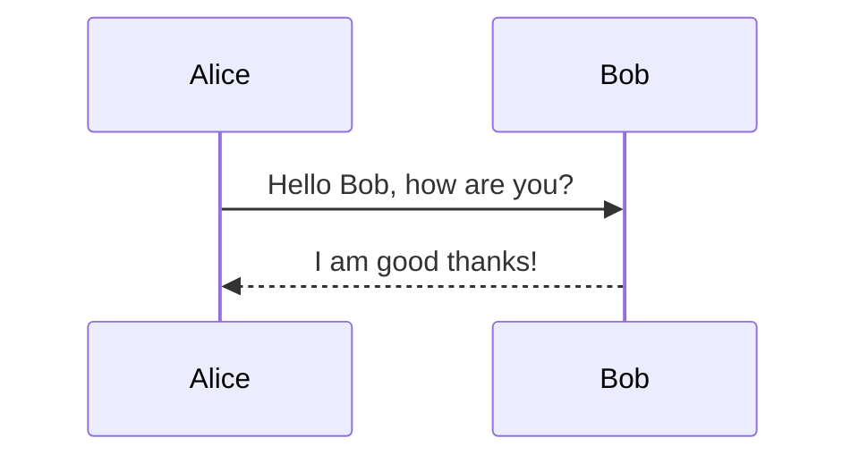
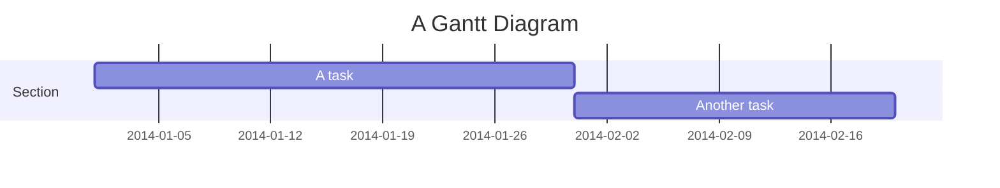

# Comprehensive Markdown Guide: Syntax, Examples, and Best Practices

This document serves as a comprehensive reference for Markdown syntax, including standard CommonMark features and GitHub Flavored Markdown (GFM) extensions. It is designed to be a training resource for understanding Markdown structure, formatting, and usage patterns.

## Table of Contents

1. [Basic Syntax](#basic-syntax)
2. [Extended Syntax](#extended-syntax)
3. [Code and Syntax Highlighting](#code-and-syntax-highlighting)
4. [Tables](#tables)
5. [Advanced Features](#advanced-features)
6. [Diagrams (Mermaid)](#diagrams-mermaid)
7. [Document Templates](#document-templates)

---

## 1. Basic Syntax

### Headers

Headers are created using the `#` symbol. The number of `#` symbols corresponds to the header level (1-6).

```markdown
# Heading Level 1
## Heading Level 2
### Heading Level 3
#### Heading Level 4
##### Heading Level 5
###### Heading Level 6
```

**Alternative Syntax (H1 and H2 only):**

```markdown
Heading Level 1
===============

Heading Level 2
---------------
```

### Paragraphs and Line Breaks

Paragraphs are separated by a blank line. To create a line break within a paragraph (soft break), refer to the end of the line with two or more spaces or a backslash `\`.

```markdown
This is a paragraph.
It continues on the same line if there is no blank line between.

This is a new paragraph.

This line ends with two spaces.  
This is a new line in the same paragraph.
```

### Emphasis

- **Bold**: Use `**text**` or `__text__`.
- *Italic*: Use `*text*` or `_text_`.
- ***Bold and Italic***: Use `***text***` or `___text___`.

```markdown
**Bold Text** using asterisks.
__Bold Text__ using underscores.

*Italic Text* using asterisks.
_Italic Text_ using underscores.

***Bold and Italic*** text.
```

### Blockquotes

Blockquotes are indicated by `>`. They can be nested.

```markdown
> This is a blockquote.
>
> > This is a nested blockquote.
>
> Back to the first level.
```

### Lists

#### Unordered Lists
Use `*`, `-`, or `+`.

```markdown
- Item 1
- Item 2
  - Sub-item 2a
  - Sub-item 2b
* Item 3
+ Item 4
```

#### Ordered Lists
Use numbers followed by a period.

```markdown
1. First item
2. Second item
3. Third item
   1. Indented item
   2. Indented item
```

---

## 2. Extended Syntax

### Strikethrough

Use `~~` to cross out text.

```markdown
~~This text is struck through.~~
```

### Task Lists

Task lists allow you to create checklists.

```markdown
- [x] Completed task
- [ ] Incomplete task
- [ ] Another incomplete task
```

### Links

#### Inline Links

```markdown
[Link Text](https://www.example.com "Optional Title")
```

#### Reference Links

Keep the source readable by defining links elsewhere.

```markdown
This is a link to [Google][1].

[1]: https://www.google.com
```

#### Auto-links

```markdown
<https://www.example.com>
<fake@example.com>
```

### Images

Similar to links, but with a preceding `!`.

```markdown

```

With link:

```markdown
[](https://www.example.com)
```

---

## 3. Code and Syntax Highlighting

### Inline Code

Wrap code in backticks `` ` ``.

```markdown
Use the `printf()` function to print text.
```

### Fenced Code Blocks

Use three backticks ``` or tildes `~~~` to create a code block. Specify the language for syntax highlighting.

#### Python Example

```python
def hello_world():
    print("Hello, World!")

if __name__ == "__main__":
    hello_world()
```

#### JavaScript Example

```javascript
const greet = (name) => {
    console.log(`Hello, ${name}!`);
};

greet('Developer');
```

#### Go Example

```go
package main

import "fmt"

func main() {
    fmt.Println("Hello, World!")
}
```

#### JSON Example

```json
{
  "key": "value",
  "array": [1, 2, 3],
  "nested": {
    "boolean": true
  }
}
```

#### Bash/Shell Example

```bash
#!/bin/bash
echo "Installing dependencies..."
npm install
```

---

## 4. Tables

Tables are created using `|` and `-`. Colons `:` control alignment.

```markdown
| Left Align | Center Align | Right Align |
| :---       | :----:       | ---:        |
| Row 1 Col 1| Row 1 Col 2  | Row 1 Col 3 |
| Row 2 Col 1| Row 2 Col 2  | Row 2 Col 3 |
| Text       | Text         | Text        |
```

**Rendered Output:**

| Left Align | Center Align | Right Align |
| :---       | :----:       | ---:        |
| Row 1 Col 1| Row 1 Col 2  | Row 1 Col 3 |
| Row 2 Col 1| Row 2 Col 2  | Row 2 Col 3 |
| Text       | Text         | Text        |

---

## 5. Advanced Features

### Horizontal Rules

Three or more asterisks, dashes, or underscores.

```markdown
---
***
___
```

### Escaping Characters

Use a backslash `\` to escape special Markdown characters.

```markdown
\* This is not a list item.
\# This is not a header.
\[This is not a link\]
```

### Footnotes

```markdown
Here is a sentence with a footnote.[^1]

[^1]: This is the footnote text.
```

### Definition Lists

```markdown
Term 1
: Definition 1

Term 2
: Definition 2
```

### Subscript and Superscript

```markdown
H~2~O  (Subscript)
X^2^   (Superscript)
```

### HTML in Markdown

You can use raw HTML for more control (if supported by the renderer).

```html
<dl>
  <dt>Definition List</dt>
  <dd>Is something people use sometimes.</dd>
  <dt>Markdown in HTML</dt>
  <dd>Does *not* work **very** well. Use HTML <em>tags</em>.</dd>
</dl>
```

---

## 6. Diagrams (Mermaid)

Many modern Markdown editors support Mermaid diagrams.

### Flowchart


### Sequence Diagram



### Gantt Chart



---

## 7. Document Templates

### Example 1: Project README

```markdown
# Project Name

> Short description of the project.

[](https://example.com)
[](LICENSE)

## Features

- Feature 1: Description
- Feature 2: Description
- Feature 3: Description

## Installation

```bash
npm install project-name
```

## Usage

```javascript
import { functionName } from 'project-name';

functionName();
```

## Contributing

1. Fork the repository
2. Create a feature branch
3. Commit your changes
4. Push to the branch
5. Open a Pull Request

## License

MIT
```

### Example 2: API Documentation

```markdown
# API Reference

## Authentication

All API requests require an API key.

`Authorization: Bearer <YOUR_API_KEY>`

## Endpoints

### Get User

Retrieves the current user's profile.

**Request:**

`GET /api/v1/user`

**Response:**

```json
{
  "id": 123,
  "name": "Jane Doe",
  "email": "jane@example.com"
}
```

### Create Post

Creates a new blog post.

**Request:**

`POST /api/v1/posts`

| Parameter | Type   | Required | Description |
| :---      | :---   | :---:    | :---        |
| title     | string | Yes      | Post title  |
| body      | string | Yes      | Post content|

**Response:**

`201 Created`
```

### Example 3: Blog Post

```markdown
# The Future of Web Development

*Published on October 27, 2023 by Author*

Web development is constantly evolving. In this post, we will explore...

## The Rise of AI

Artificial Intelligence is changing how we write code.

> "AI will not replace developers, but developers using AI will replace those who don't."

## Conclusion

The future is bright.

---

*Tags: #webdev, #ai, #future*
```

---

**End of Guide**
