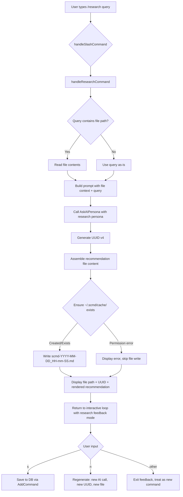

# Design Document: Research Persona

## Overview

The `/research <query>` command adds a new AI persona to the SCMD interactive CLI that acts as a research analyst. Unlike existing personas (ubuntu, debian, fedora, etc.) that produce ephemeral AI responses and use the standard feedback loop with execute options, the Research persona has unique behaviour:

1. It analyses queries and generates structured markdown recommendations (never executable instructions).
2. It can read files/scripts/code when a file path is provided in the query.
3. Every recommendation is automatically saved to `~/.scmd/cache/scmd-YYYY-MM-DD_HH-mm-SS.md` with a UUID v4 on the first line.
4. It uses a custom feedback loop offering only `[s]` save-to-DB and `[n]` regenerate — no execute option.

The Research persona requires its own handler function rather than reusing `handlePersonaCommand()` because of the file-reading, cache-writing, and custom feedback loop behaviours.

## Architecture

The feature integrates into the existing SCMD architecture at three points:

1. **Persona Registry** (`internal/ai/aiPersona.go`): A new `"research"` entry in `GetPersonas()` with the analyst system prompt.
2. **Command Dispatcher** (`internal/cli/commands.go`): A new `/research` case in `handleSlashCommand()` that calls a dedicated `handleResearchCommand()`.
3. **Feedback Loop** (`internal/cli/interactive.go`): A research-specific feedback path that skips execute options and handles cache file regeneration on `[n]`.

New code is added in a single new file `internal/cli/research.go` to keep the research-specific logic isolated from the existing command and interactive modules.



## Components and Interfaces

### New File: `internal/cli/research.go`

This file contains all research-persona-specific logic.

#### Functions

| Function | Signature | Description |
|---|---|---|
| `handleResearchCommand` | `func handleResearchCommand(args string) (response string, uid string, filePath string)` | Main entry point. Parses the query, optionally reads a file, calls the AI, generates UUID, writes cache file, renders output. Returns the AI response, UUID, and saved file path for the feedback loop. |
| `parseResearchQuery` | `func parseResearchQuery(args string) (query string, fileContent string, filePath string, err error)` | Parses the raw args to detect if a file path is present. If a token in args is a valid readable file path, reads it and returns the content separately from the remaining query text. |
| `generateRecommendationID` | `func generateRecommendationID() string` | Generates a UUID v4 string using `github.com/google/uuid` (already an indirect dependency). |
| `formatIDHeader` | `func formatIDHeader(uid string) string` | Returns `<!-- SCMD-ID: <uid> -->`. |
| `buildRecommendationFilename` | `func buildRecommendationFilename(t time.Time) string` | Returns `scmd-YYYY-MM-DD_HH-mm-SS.md` for the given time. |
| `assembleRecommendationContent` | `func assembleRecommendationContent(uid string, query string, recommendation string) string` | Assembles the full file content: ID header line, blank line, `# <query>` heading, blank line, recommendation body. |
| `ensureCacheDir` | `func ensureCacheDir() (string, error)` | Returns the path `~/.scmd/cache/` after creating it with `0755` permissions if it doesn't exist. Returns an error if creation fails. |
| `writeRecommendationFile` | `func writeRecommendationFile(dir string, filename string, content string) (string, error)` | Writes content to `dir/filename`. Returns the full path on success. |
| `buildResearchFeedbackPrompt` | `func buildResearchFeedbackPrompt() string` | Returns the fixed string `[s] - Good answer (saves to db)  |  [n] - New answer (discards)`. |
| `isResearchFeedbackInput` | `func isResearchFeedbackInput(input string) bool` | Returns true only for `"s"` or `"n"`. |

### Modified File: `internal/ai/aiPersona.go`

Add a `"research"` entry to the `GetPersonas()` map:

```go
"research": {
    Name:        "Research Analyst",
    Description: "Analyse, research, and provide markdown recommendations",
    SystemPrompt: `You are a Research Analyst AI. Your role is to analyse queries, research topics, and provide structured markdown recommendations.

RULES:
1. Always format your response as structured markdown with clear headings.
2. Present all code, scripts, and fixes as RECOMMENDATIONS ONLY — never as instructions to execute.
3. Every response MUST include at minimum these sections:
   ## Analysis
   ## Recommendation
   ## Summary
4. When the user asks for fixes, include a "## Proposed Fix" section with code blocks showing suggested changes.
5. When the user asks for code creation or alternative scripts, include an "## Alternatives" section listing each option with pros and cons.
6. Use bullet points, numbered lists, and code blocks for clarity.
7. End every response with a concise Summary section.`,
},
```

### Modified File: `internal/cli/commands.go`

Add a `/research` case to `handleSlashCommand()`:

```go
case "/research":
    if args == "" {
        fmt.Println("Usage: /research <question or file path>")
        return ""
    }
    resp, uid, fpath := handleResearchCommand(args)
    // Store metadata for the feedback loop
    lastResearchUID = uid
    lastResearchFilePath = fpath
    return resp
```

### Modified File: `internal/cli/interactive.go`

The main interactive loop needs to detect when the last response came from `/research` and use the research-specific feedback path:

- Add a `lastFromResearch bool` flag alongside the existing `lastFromShow`.
- When `lastFromResearch` is true, use `isResearchFeedbackInput()` instead of `isFeedbackInput()`.
- When `lastFromResearch` is true, display `buildResearchFeedbackPrompt()` instead of `buildFeedbackPrompt()`.
- On `"s"`: save to DB using `database.AddCommand(lastAIResponse, "AI-generated response for: "+lastQuery, ai.GetBestEmbedding)`.
- On `"n"`: regenerate by calling `handleResearchCommand(lastQuery)` again (which produces a new UUID and new cache file).
- Any other input: clear the feedback state and process as a new command.

## Data Models

### Recommendation File Structure

```
<!-- SCMD-ID: xxxxxxxx-xxxx-4xxx-yxxx-xxxxxxxxxxxx -->

# <original query>

<AI-generated recommendation content in markdown>
```

### Cache Directory

- Path: `~/.scmd/cache/`
- Permissions: `0755` (owner rwx, group rx, others rx)
- File naming: `scmd-YYYY-MM-DD_HH-mm-SS.md` using local time, 24-hour clock, zero-padded

### Timestamp Format

The timestamp `YYYY-MM-DD_HH-mm-SS` uses Go's reference time layout:

```go
const researchTimestampLayout = "2006-01-02_15-04-05"
```

### UUID Format

Standard UUID v4: `xxxxxxxx-xxxx-4xxx-yxxx-xxxxxxxxxxxx` where `y` is one of `8`, `9`, `a`, `b`.

Wrapped in an HTML comment for the file header: `<!-- SCMD-ID: <uuid> -->`

## Correctness Properties

*A property is a characteristic or behavior that should hold true across all valid executions of a system — essentially, a formal statement about what the system should do. Properties serve as the bridge between human-readable specifications and machine-verifiable correctness guarantees.*

### Property 1: Query parsing separates file path from text

*For any* combination of a valid file path and arbitrary query text, `parseResearchQuery` SHALL correctly identify the file path component and return the remaining text as the query, with the file's content populated.

**Validates: Requirements 3.3**

### Property 2: UUID header formatting

*For any* valid UUID v4 string, `formatIDHeader` SHALL produce a string matching the pattern `<!-- SCMD-ID: <uuid> -->` where `<uuid>` conforms to the UUID v4 format `[0-9a-f]{8}-[0-9a-f]{4}-4[0-9a-f]{3}-[89ab][0-9a-f]{3}-[0-9a-f]{12}`.

**Validates: Requirements 4.1, 4.2**

### Property 3: UUID uniqueness

*For any* batch of N generated UUIDs (where N is drawn randomly up to 1000), all UUIDs in the batch SHALL be distinct.

**Validates: Requirements 4.3**

### Property 4: Timestamp filename format

*For any* valid `time.Time` value, `buildRecommendationFilename` SHALL produce a string matching the pattern `scmd-\d{4}-\d{2}-\d{2}_\d{2}-\d{2}-\d{2}\.md` with zero-padded 24-hour time components.

**Validates: Requirements 6.1, 9.1**

### Property 5: Timestamp round-trip

*For any* valid `time.Time` value, formatting it with `buildRecommendationFilename` and then parsing the timestamp portion back using the same layout SHALL produce a time equal to the original time truncated to the second.

**Validates: Requirements 9.2**

### Property 6: Recommendation file content structure

*For any* triple of (UUID string, query string, recommendation string), `assembleRecommendationContent` SHALL produce content where: the first line is `<!-- SCMD-ID: <uuid> -->`, the second line is blank, the third line is `# <query>`, the fourth line is blank, and the remainder is the recommendation string.

**Validates: Requirements 6.2**

### Property 7: Recommendation file round-trip

*For any* triple of (UUID string, query string, recommendation string), assembling the content with `assembleRecommendationContent`, writing it to a temporary file, and reading it back SHALL produce content identical to the assembled string.

**Validates: Requirements 6.5**

### Property 8: Research feedback prompt correctness

*For any* invocation of `buildResearchFeedbackPrompt`, the returned string SHALL contain `[s]` and `[n]`, and SHALL NOT contain `[x]`, `Execute`, or any numeric block selector pattern `[<digit>]`.

**Validates: Requirements 8.1, 8.2**

### Property 9: Non-feedback input rejection

*For any* string that is not exactly `"s"` and not exactly `"n"`, `isResearchFeedbackInput` SHALL return `false`.

**Validates: Requirements 8.5**

## Error Handling

| Scenario | Behaviour |
|---|---|
| No query provided (`/research` alone) | Display usage message, return empty string |
| File path does not exist | Display error with OS error message, proceed without file context (use query text only if present, otherwise abort) |
| File path is not readable (permissions) | Display error with OS error message, proceed without file context |
| Cache directory cannot be created | Display error with OS error, skip file writing, still display recommendation in CLI |
| Recommendation file cannot be written | Display error with OS error, still display recommendation in CLI |
| AI provider unavailable | Handled by existing `AskAIPersona` → `AskAI` error path; display error message |
| AI provider returns empty response | Display "Failed to generate recommendation" message |
| UUID generation failure | Extremely unlikely with `google/uuid`; if it occurs, use a fallback timestamp-based ID |

All error paths that prevent file writing still display the recommendation to the user so no work is lost.

## Testing Strategy

### Property-Based Tests (using `pgregory.net/rapid`)

The project already uses `pgregory.net/rapid` for property-based testing (see `internal/cli/feedback_property_test.go`). Each property test runs a minimum of 100 iterations.

| Property | Test Function | File |
|---|---|---|
| Property 1: Query parsing | `TestProperty_ResearchQueryParsing` | `internal/cli/research_property_test.go` |
| Property 2: UUID header formatting | `TestProperty_UUIDHeaderFormat` | `internal/cli/research_property_test.go` |
| Property 3: UUID uniqueness | `TestProperty_UUIDUniqueness` | `internal/cli/research_property_test.go` |
| Property 4: Timestamp filename format | `TestProperty_TimestampFilenameFormat` | `internal/cli/research_property_test.go` |
| Property 5: Timestamp round-trip | `TestProperty_TimestampRoundTrip` | `internal/cli/research_property_test.go` |
| Property 6: File content structure | `TestProperty_RecommendationContentStructure` | `internal/cli/research_property_test.go` |
| Property 7: File round-trip | `TestProperty_RecommendationFileRoundTrip` | `internal/cli/research_property_test.go` |
| Property 8: Feedback prompt correctness | `TestProperty_ResearchFeedbackPrompt` | `internal/cli/research_property_test.go` |
| Property 9: Non-feedback input rejection | `TestProperty_ResearchNonFeedbackRejection` | `internal/cli/research_property_test.go` |

Each test is tagged with: `Feature: research-persona, Property N: <property_text>`

**Property test configuration:**
- Library: `pgregory.net/rapid` (already in `go.mod`)
- Minimum iterations: 100 (rapid's default)
- Test file: `internal/cli/research_property_test.go`

### Unit Tests (example-based)

| Test | Description | File |
|---|---|---|
| `TestResearchPersonaRegistered` | Verify "research" key exists in `GetPersonas()` with correct Name, Description, and SystemPrompt keywords | `internal/ai/aiPersona_test.go` |
| `TestResearchCommandRouting` | Verify `/research foo` routes to research handler | `internal/cli/research_test.go` |
| `TestResearchUsageMessage` | Verify `/research` with no args shows usage | `internal/cli/research_test.go` |
| `TestResearchFileReadValid` | Create temp file, verify contents are read and included | `internal/cli/research_test.go` |
| `TestResearchFileReadInvalid` | Pass non-existent path, verify error message | `internal/cli/research_test.go` |
| `TestEnsureCacheDirCreates` | Verify directory creation with correct permissions | `internal/cli/research_test.go` |
| `TestEnsureCacheDirExists` | Verify existing directory is not modified | `internal/cli/research_test.go` |
| `TestResearchSaveToDBFeedback` | Verify `"s"` triggers `AddCommand` | `internal/cli/research_test.go` |
| `TestResearchRegenerateFeedback` | Verify `"n"` triggers regeneration with new UUID/file | `internal/cli/research_test.go` |
| `TestResearchSystemPromptContent` | Verify system prompt contains required section names (Analysis, Recommendation, Summary, Proposed Fix, Alternatives) | `internal/ai/aiPersona_test.go` |

### Test Balance

- **Property tests** cover the pure functions with universal properties: parsing, formatting, round-trips, and prompt correctness.
- **Unit tests** cover specific integration points (routing, DB save, file I/O edge cases) and smoke checks (persona registration, system prompt content).
- Together they provide comprehensive coverage without redundancy